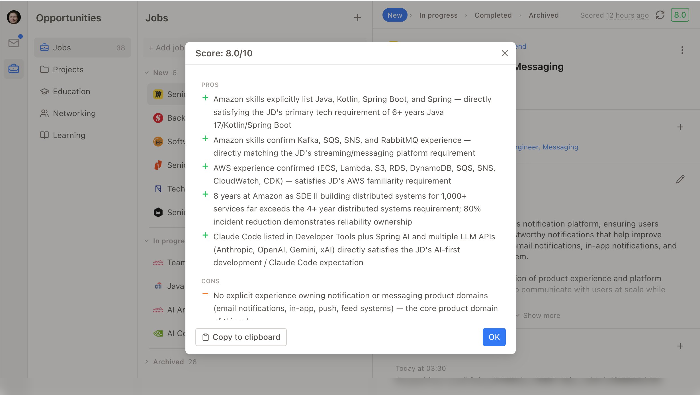

# Career Repo

A local-first, private career tracking tool that runs entirely on your machine.

Career Repo feels like a daily organiser – familiar, calm, always one click away, bookmarked in your browser as "Career".
You return to it when something interesting in your professional life happens: a new career opportunity, an interview, a role change.
All artifacts – cover letters, CV snapshots, case studies – are downloadable at any moment, ready to send to a recruiter or a partner.

Over years, it becomes the single place that knows your entire professional story.

Built with FastAPI, SQLite, and Claude Code CLI.



---

## Demo

[](https://codespaces.new/donmutti/career-repo)

Click the badge to launch a fully running Career Repo instance in your browser – no local setup required. The API and UI start automatically.

When done, delete the codespace at [github.com/codespaces](https://github.com/codespaces) to avoid using your free monthly quota.

---

## Single-User Mode

Career Repo is designed for one person running:

- **No server storage** – all data lives in a local SQLite database. To save your data remotely, commit `db/data.json` to your remote repo.
- **No multi-device access** – the app runs on one machine at a time. To move between devices, commit `db/data.json`, pull it on the other machine, and restart the app.
- **No access control** – no login or sessions. Data is accessible to anyone with access to your machine.
- **One Gmail account** – the Gmail MCP plugin authenticates to a single Google account. Emails at other addresses are not scanned unless forwarded to the connected account.
- **One Claude Code account** – AI operations (sourcing, cover letter generation) run through your local Claude Code CLI. Concurrent use from multiple sessions is not supported.

---

## Quick Start

**Prerequisites:**

- [Git](https://git-scm.com/downloads) – version control, needed to clone the repo
- [uv](https://docs.astral.sh/uv/getting-started/installation/) – Python package manager, needed to install Python dependencies
- [Node.js 20+](https://nodejs.org) – JavaScript runtime, needed to run the UI dev server
- [Claude Code CLI](https://code.claude.com) – local AI assistant, needed to run AI features (job scoring, cover letter generation, etc.)

**Checkout:**

```bash
git clone https://github.com/donmutti/career-repo
cd career-repo
```

**Install** (one-time, local to the repo):

```bash
uv venv venv              # creates local virtual environment in `venv/`
source venv/bin/activate  # On Windows: venv\Scripts\activate
uv pip install -e .       # install app dependencies in editable mode
```

**Configure:**

Edit `config.yml` at the repo root to customize API and UI ports and database paths:

```yaml
api:
  host: "127.0.0.1"
  port: 8000

ui:
  port: 3000

db:
  path: "./db/data.db"
  dump_path: "./db/data.json"
  attachment_path: "./db/attachments"
  resumes_path: "./db/resumes"
  images_path: "./db/images"
```

**Run:**

Start the API server (database initializes automatically on first run):

```bash
python3 api/main.py
```

In a second terminal, start the UI:

```bash
cd ui && npm install && npm run dev
```

Open `http://localhost:3000` (or whichever port is set in `config.yml`) in your browser. On first run you'll be guided through onboarding.

**Shutdown:**

Press `Ctrl+C` in each terminal, or:

```bash
pkill -f "python3 api/main.py"
```

---

## Contributing

See [CONTRIBUTING.md](CONTRIBUTING.md).
